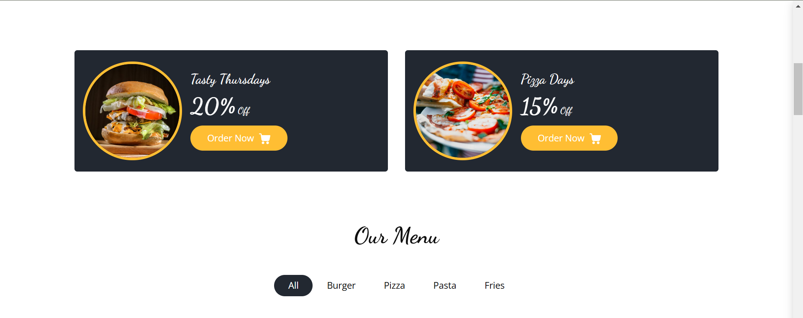
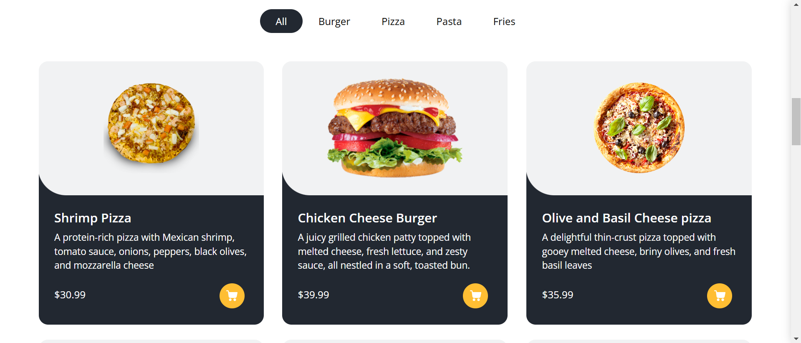
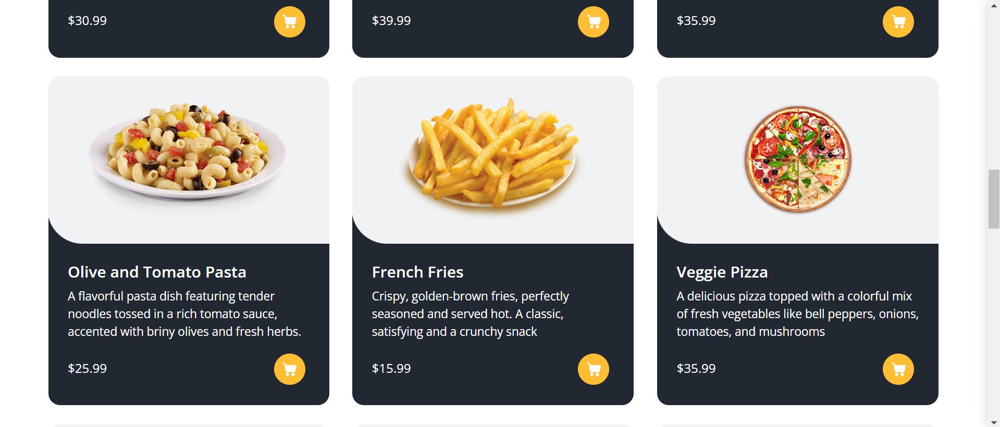
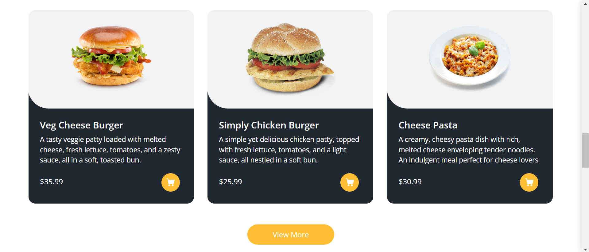
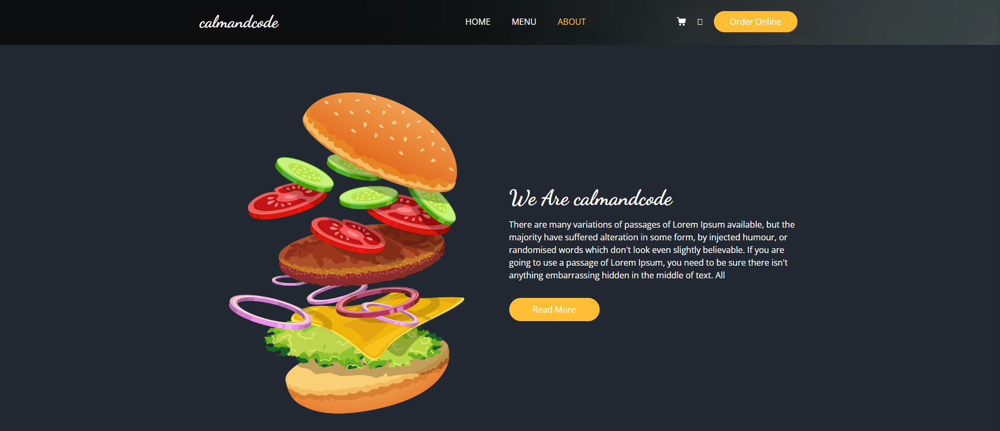
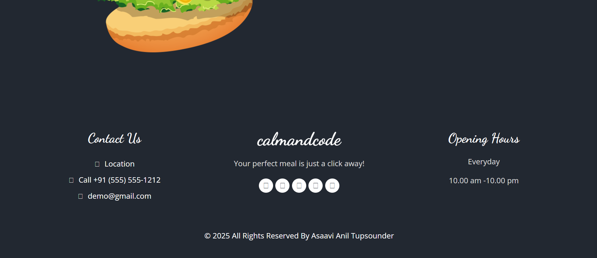
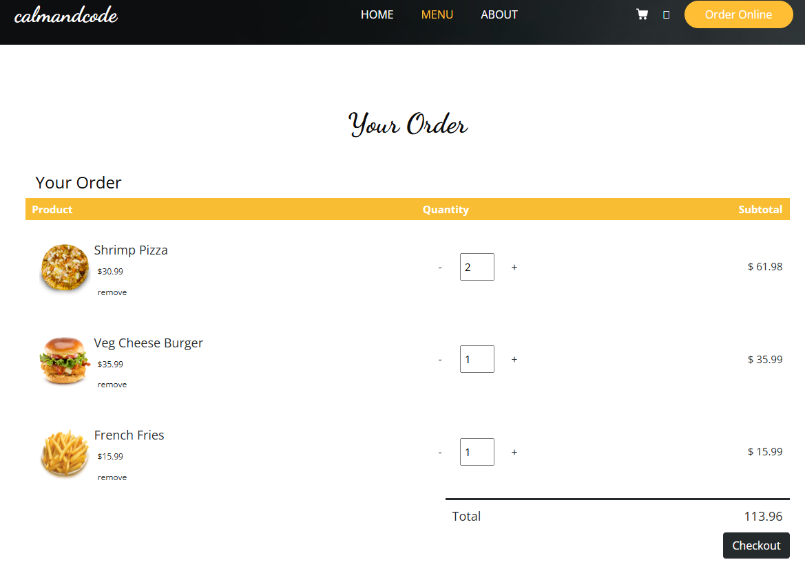
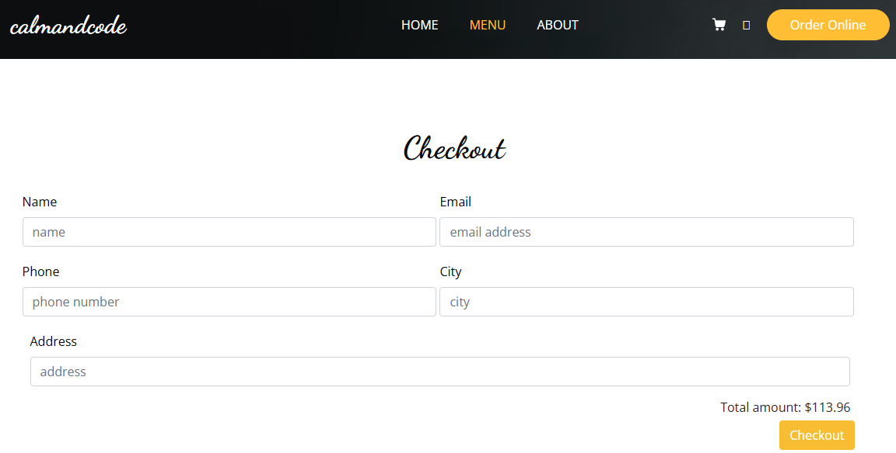
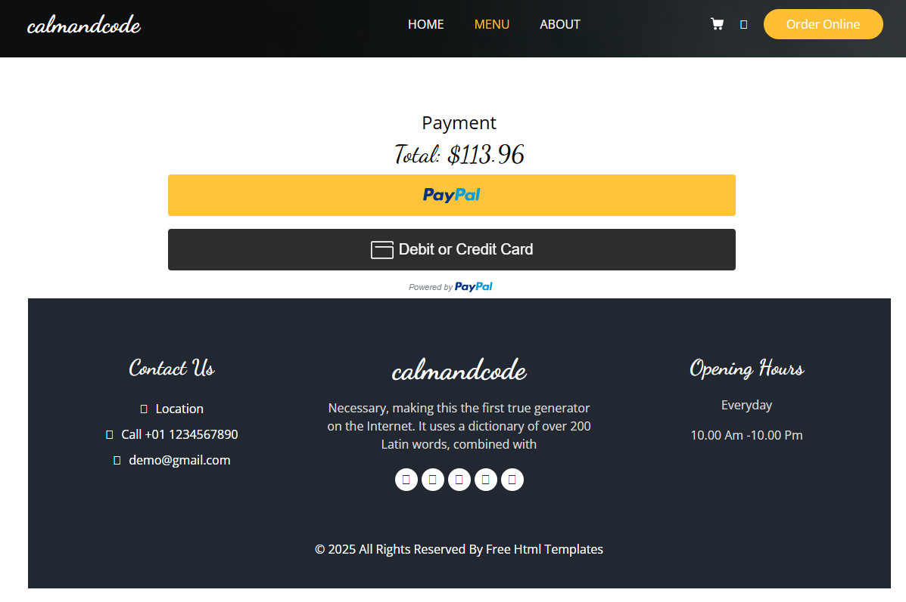
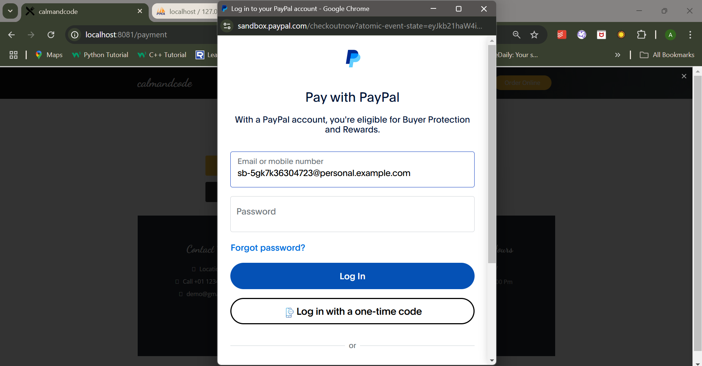

# E-Commerce Web Application

This is a simple e-commerce web application built using **Node.js**, **Express**, and **MySQL**. The application allows users to browse products, add them to a shopping cart, and proceed to checkout. It also includes features like product search, cart management, and order placement.

---

## Features

- **Product Browsing**: View a list of available products.
- **Shopping Cart**: Add, remove, and update product quantities in the cart.
- **Checkout**: Place orders with shipping and payment details.
- **Order Management**: View order summaries and track order status.
- **Session Management**: Persistent cart and user session management.

---

## Technologies Used

- **Backend**: Node.js, Express
- **Frontend**: EJS (Embedded JavaScript templates)
- **Database**: MySQL
- **Session Management**: Express Session
- **Environment Variables**: `dotenv`

---

## Prerequisites

Before running the project, ensure you have the following installed:

- **Node.js** (v14 or higher)
- **MySQL** (or any MySQL-compatible database)
- **npm** (Node Package Manager)

---

## Project Structure

```
index.js         - Main entry point for the application. Sets up Express server, routes, and middleware.
views/           - Contains EJS templates for rendering the frontend.
public/          - Static files like CSS, JavaScript, and images.
.env             - Environment variables for database configuration.
package.json     - Lists project dependencies and scripts.
```
---

## API Endpoints

---

### Product and Cart Management
- `GET /` - Home page with a list of products.
- `GET /products` - Display all products.
- `GET /single_product` - View details of a single product.
- `POST /add_to_cart` - Add a product to the shopping cart.
- `GET /cart` - View the shopping cart.
- `POST /remove_product` - Remove a product from the cart.
- `POST /edit_product_quantity` - Update the quantity of a product in the cart.

---

### Checkout and Payment
- `GET /checkout` - Proceed to the checkout page.
- `POST /place_order` - Place an order.
- `GET /payment` - Payment page.
- `GET /verify_payment` - Verify payment and update order status.
- `GET /thank_you` - Order confirmation page.

---

## Environment Variables

---
The following environment variables are required:

```
DB_HOST=your_database_host
DB_USER=your_database_username
DB_PASSWORD=your_database_password
DB_NAME=your_database_name
```
---

## Dependencies

- **Express** - Web framework for Node.js.
- **EJS** - Templating engine for rendering HTML.
- **MySQL** - MySQL database driver.
- **Express Session** - Session management for user cart and authentication.
- **Body Parser** - Middleware for parsing request bodies.
- **Dotenv** - Loads environment variables from a `.env` file.
- **PayPal SDK** - Integrated for real and sample (pseudo) payments.

---

## Installation

1. Clone the repository:
   ```sh
   git clone https://github.com/your-username/your-repo.git
   ```
2. Navigate to the project directory:
   ```sh
   cd your-repo
   ```
3. Install dependencies:
   ```sh
   npm install
   ```
4. Set up environment variables in a `.env` file.
5. Start the server:
   ```sh
   npm start
   ```
---

## Database Setup

This project uses **XAMPP**, **PHPMyAdmin**, and **MySQL** for database management:

- **XAMPP** is used as a local server environment.
- **PHPMyAdmin** provides a graphical interface to manage the MySQL database.
- **MySQL** is used as the primary database.

---
### Steps to Set Up the Database

1. Start **Apache** and **MySQL** in XAMPP.
2. Open **PHPMyAdmin** in your browser: [`http://localhost/phpmyadmin`](http://localhost/phpmyadmin).
3. Create a new database with the name specified in your `.env` file.
4. Import the provided SQL file or create necessary tables manually.

---

## Payment Integration

This project integrates **PayPal Payment Gateway** to support:
- **Real Payments**: Users can make actual transactions using PayPal.
- **Sample (Pseudo) Payments**: A sandbox mode is available for testing transactions without real money.

---

## Screenshots












---


